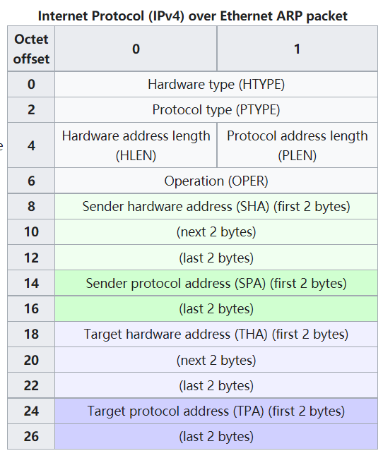

# Network interface

## IP stack

### Application layer

The application layer is the scope within which **applications, or processes**, **create user data and communicate this data to other applications** on another or the same host. 

The applications make use of the services provided by the underlying lower layers, especially the transport layer which provides reliable or unreliable pipes to other processes. The communications partners are characterized by the application architecture, such as the client–server model and peer-to-peer networking. This is the layer in which all application protocols, such as SMTP, FTP, SSH, HTTP, operate. Processes are addressed via ports which essentially represent services.

### Transport layer

The transport layer performs **host-to-host communications** on either the local network or remote networks separated by routers.

It provides a channel for the communication needs of applications. 

- UDP is the basic transport layer protocol, providing an unreliable connectionless datagram service. 
- The TCP (Transmission Control Protocol) provides flow-control, connection establishment, and reliable transmission of data.

### Internet layer

The internet layer **exchanges datagrams across network boundaries**. 

**It provides a uniform networking interface** that hides the actual topology (layout) of the underlying network connections. **It is therefore also the layer that establishes internetworking**. Indeed, it defines and establishes the Internet. 

This layer defines the addressing and routing structures used for the TCP/IP protocol suite. The primary protocol in this scope is the Internet Protocol, which defines IP addresses. Its function in routing is to transport datagrams to the next host, functioning as an IP router, that has the connectivity to a network closer to the final data destination.

### Link layer

The link layer defines the networking methods **within the scope of the local network** link on which hosts communicate **without intervening routers**. 

This layer includes the protocols used to describe the local network topology and the interfaces needed to affect the transmission of Internet layer datagrams to next-neighbor hosts.

## ARP

The Address Resolution Protocol (ARP) is a communication protocol used for discovering the link layer address, such as a MAC address, associated with a given internet layer address, typically an IPv4 address. This mapping is a critical function in the Internet protocol suite.

In Internet Protocol Version 6 (IPv6) networks, the functionality of ARP is provided by the Neighbor Discovery Protocol (NDP).

The Address Resolution Protocol is a request-response protocol whose **messages are encapsulated by a link layer protocol**. It is communicated within the boundaries of a single network, never routed across internetworking nodes. **This property places ARP into the link layer of the Internet protocol suite**.

### Packet structure

## Function requirement

### Send datagram

This method is called when the caller (your TCPConnection or a router) wants to send an outbound Internet (IP) datagram to the next hop. It’s your interface’s job to translate this datagram into an Ethernet frame and (eventually) send it.

- If the destination Ethernet address is already known, send it right away. 

  Create an Ethernet frame, set the payload to be the serialized datagram, and set the source and destination addresses.

- If the destination Ethernet address is unknown, **broadcast an ARP request for the next hop’s Ethernet address, and queue the IP datagram so it can be sent after the ARP reply is received.**

Except: You don’t want to flood the network with ARP requests. **If the network interface already sent an ARP request about the same IP address in the last five seconds, don’t send a second request**—just wait for a reply to the first one. Again, queue the datagram until you learn the destination Ethernet address.

### Receive frame

This method is called when an Ethernet frame arrives from the network. 

The code should ignore any frames not destined for the network interface (meaning, the Ethernet destination is either the broadcast address or the interface’s own Ethernet address stored in the ethernet address member variable). 

- If the inbound frame is IPv4, parse the payload as an InternetDatagram and, if successful, return the resulting InternetDatagram to the caller. 
- If the inbound frame is ARP, parse the payload as an ARPMessage and, if successful, remember the mapping between the sender’s IP address and Ethernet address for 30 seconds. (**Learn mappings from both requests and replies**.) In addition, if it’s an ARP request asking for our IP address, send an appropriate ARP reply.

## Solution

Nothing fancy.
