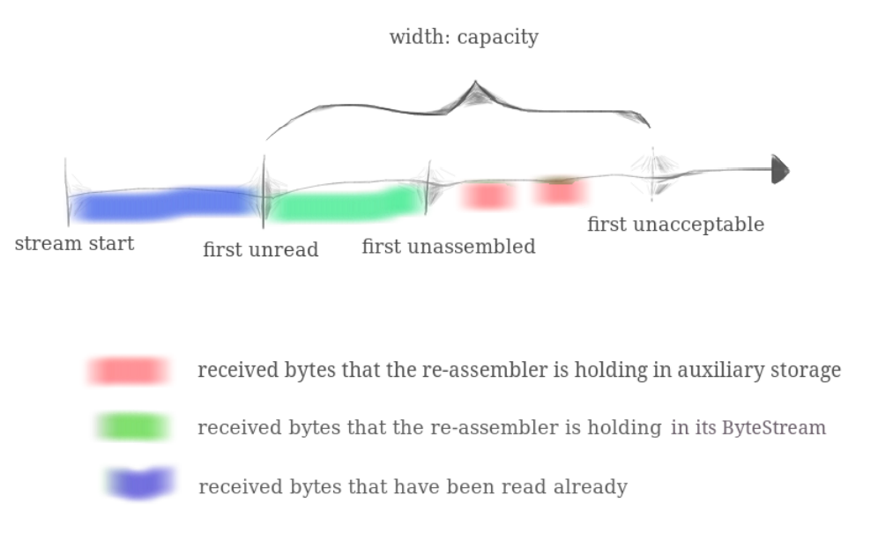
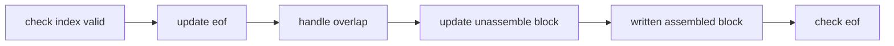
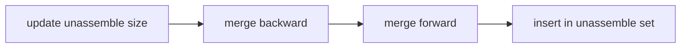

# Stream reassembler

## Why reassemble stream?

The TCP sender is dividing its byte stream up into short segments (substrings no more than about 1,460 bytes apiece) so that they each fit inside a datagram. 

But the network might reorder these datagrams, or drop them, or deliver them more than once. The receiver must reassemble the segments into the contiguous stream of bytes that they started out as.

TCP robustness against reordering and duplication comes from its ability to stitch arbitrary excerpts of the byte stream back into the original stream. Implementing this in a discrete testable module will make handling incoming segments much easier.

## Function requirement

- It will receive substrings, consisting of **a string of bytes**, and **the index of the first byte** of that string **within the larger stream**. 

- Each byte of the stream has its own unique index, starting from zero and counting upwards. 

- The StreamReassembler will own a ByteStream for the output: 
  - As soon as the reassembler knows the next byte of the stream, it will write it into the ByteStream.
  - The owner can access and read from the ByteStream whenever it wants

## Interface

```c++
// Construct a `StreamReassembler` that will store up to `capacity` bytes.
StreamReassembler(const size_t capacity);
// Receive a substring and write any newly contiguous bytes into the stream,
// while staying within the memory limits of the `capacity`. Bytes that would
// exceed the capacity are silently discarded.
//
// `data`: the substring
// `index` indicates the index (place in sequence) of the first byte in `data`
// `eof`: the last byte of this substring will be the last byte in the entire stream
void push_substring(const string &data, const uint64_t index, const bool eof);
// Access the reassembled ByteStream (your code from Lab 0)
ByteStream &stream_out();
// The number of bytes in the substrings stored but not yet reassembled
size_t unassembled_bytes() const;
// Is the internal state empty (other than the output stream)?
bool empty() const;
```

### About capacity

Your push substring method will **ignore any portion of the string that would cause the StreamReassembler to exceed its “capacity”**: a limit on memory usage, i.e. the maximum number of bytes it is ever allowed to store. 

This prevents the reassembler from using an unbounded amount of memory, no matter what the TCP sender decides to do. We’ve illustrated this in the picture below. The “capacity” is an upper bound on both:

- The number of bytes in the reassembled ByteStream (shown in green below)
- The maximum number of bytes that can be used by “unassembled” substrings (shown in red)



## Solution

### Granularity

From the single char view do assemble will have a great time consume, so consider each substring is a block, do block merge. It's intuitive to **encapsulate a substring as a block** with elements: **start_index, end_index and data**.

### Data Structure

The assembled string will be written to _output stream, so how to store the unassembled stream?

Using std::set is a good choice but why?

- We want to reassemble substring according to index, so if we keep unassembled substring in a set, the set will automatic order those substring for us, which is convenient.(of course rewrite operator < is necessary).
- We can take advantage of lower_bound() method to find best location to merge substring when insert a new substring.

### Work flow



#### Check index valid

ignore those substring:

- index exceed capacity
- index has been assembled

#### Handle overlap

Part of the incoming substring has been assembled, so pick the unassembled part out, encapsulate as a new block(with new start_index, end_index and data).

#### Update unassemble block

Most of the work was done in this module.



- unassembled size will also be update(decreased ) when merge backward and forward
- use lower_bound (>=) instead of upper_bound (>).

- block may be erased during merge, **relocate iterator using lower_bound after erasing.**

- merge backward then forward OR forward then backward both OK, just take care of ending condition.
- at last of this module, insert the merged block into unassembled set. Notice now the front block may be assembled successfully, we will check and write in next module.

#### Written assembled block and check eof

Check the front block of unassembled set, if its start index is what we need, write this block to output.

- since we use set to sort block(ascending order), if any block will fit, it must be the front one.
- due to the previous merge process, any block may be merged has done, so check the very beginning block is sufficient.
- if unassembled count is zero or has received eof flag, end input.