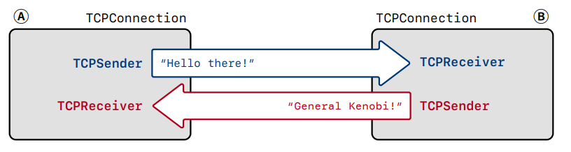
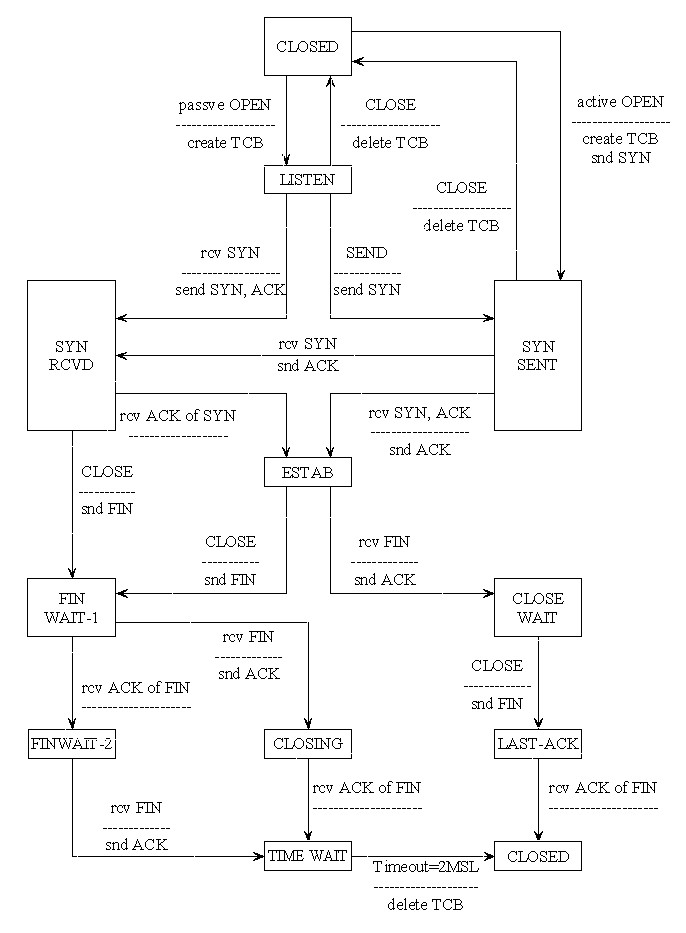

# Tcp connection

## Recall

The big picture:

TCP reliably conveys a pair of flow-controlled byte streams, one in each direction. Two parties participate in the TCP connection, and each party acts as both “sender” (of its own outbound byte-stream) and “receiver” (of an inbound byte-stream) at the same time:

## Function requirement

### Receiving segments

The TCPConnection receives TCPSegments from the Internet when its segment received method is called. When this happens, the TCPConnection looks at the segment and:

- If the RST (reset) flag is set, sets both the inbound and outbound streams to the error state and kills the connection permanently.
- Gives the segment to the **TCPReceiver** so it can inspect the fields it cares about on incoming segments: seqno, SYN , payload, and FIN.
- If the ACK flag is set, tells the **TCPSender** about the fields it cares about on incoming segments: ackno and window size.

- If the incoming segment occupied any sequence numbers, the **TCPConnection** makes sure that **at least one segment is sent in reply, to reflect an update in the ackno and window size**.

### Sending segments

The TCPConnection will send TCPSegments over the Internet:

- Any time the **TCPSender** has pushed a segment onto its outgoing queue, having **set** the fields it’s responsible for on outgoing segments: (**seqno, SYN , payload, and FIN**).

- Before sending the segment, the **TCPConnection** will ask the TCPReceiver for the fields it’s responsible for on outgoing segments: ackno and window size. If there is an ackno, it will **set the ack flag and the fields in the TCPSegment**.

### When time passes

The TCPConnection has a tick method that will be called periodically by the operating system. When this happens, the TCPConnection needs to:

- Tell the TCPSender about the passage of time. 
- Abort the connection, and send a reset segment to the peer (an empty segment with the RST flag set), if the number of consecutive retransmissions is more than an upper limit.
- End the connection cleanly if necessary.

## Solution

## TCP state

### Segment received

Step 1: Check connection active state, return if TCP connection is non-active.

- RST state (ERROR)

  If receives a segment with RST flag, the TCP connection should be non-active, and outbound and inbound byte streams of local peer should both be in error state.

- Un-clean shutdown (NORMAL)

  If consecutive retransmission counts more than limit value, sents RST flag and switches to unclean shutdown state. Of course the connection will be non-active.

- Clean shutdown (UN-NORMAL)
  - If local peer is in passive close state (which means remote peer sends FIN first), do NOT needs to linger after streams finish. Set connection non-active.
  - If local peer is in active close state (which means remote peer sends FIN first) , needs to linger after streams finish, if linger time is more 10*RTO, set connection non-active.

Step 2: Check RST flag of incoming segment.

If RST flag was set, do the following:

- Set inbound and outbound streams in error state.
- Set connection in non-active state.

Step 3: Reset timer once received segment.

Step 4: Check connect state.

Connect if following requirements are satisfied, then return.

- Incoming segment has SYN flag.
- Sender has not sent SYN segment yet.
- Receiver has not received any ackno yet.

Step 5: Receiver handles incoming segment.

- Reassembles incoming stream bytes (payload).
- Update ackno and window size after reassembling.

Step 6: Sender handles incoming segment

- Update received ackno, next_seqno, bytes_in_flight, remaining window size and outstanding queue.
- Fill window according to remaining window size.

Step 7: Check needs to sent empty segment or not.

- If incoming segment is not empty, but sender outbound stream is empty, sent empty segment to update ackno and window size.

Step 8: Send all segments in queue.

- Set ackno, ACK flag, window size according to receiver (Step 5 update ackno and window size).
- Check clean shutdown.

### Clean shutdown

If sender stream_out queue is empty (no more segments to send right now), do clean shutdown, 

Step 1: Check input_end of receiver stream_out.

- If input_ended is TRUE

  Unassembled bytes amount is zero and FIN flag was received, nothing weird, go to next step.

- If input_ended is FALSE

  Still exist unassembled bytes, not going to shutdown, return.

Step 2: Check eof flag of sender stream_in.

The prerequisite according to Step 1: received FIN and has no unassembled bytes. 

- If eof flag is TRUE

  If sender outstanding queue is empty (all segments are acknowledged):

  - If remote peer send FIN first (passive close), closes connection (un-active)
  - If local peer send FIN first (active close), and TIME_WAIT passes, closes connection (un-active)

  Else return until all segments are acknowledged.

- If eof flag is FLASE

  Sender still has bytes to sent, which means the remote peer send FIN first, the connection state will be set as passive close. When sender outstanding queue is empty, the connection will be closed.

> Difference between input_ended and eof:
>
> Byte_stream has two data flow direction: write(in) and read(out)
>
> 1. input_end means: write end
>
> 2. eof means: write end(stop writing) and read end(buffer empty)

 ### Un-clean shutdown

Step 1: Set connection un-active, inbound and outbound stream should be in error state.

Step 2: Sent RST segment.

- Send empty segment

  The RST segment needs a proper seqno. We can get a seqno from segment in segments_out(which has proper seqno), in case segments_out is empty, we send a empty segment first.

- Get segment from segment_out queue and set RST flag.