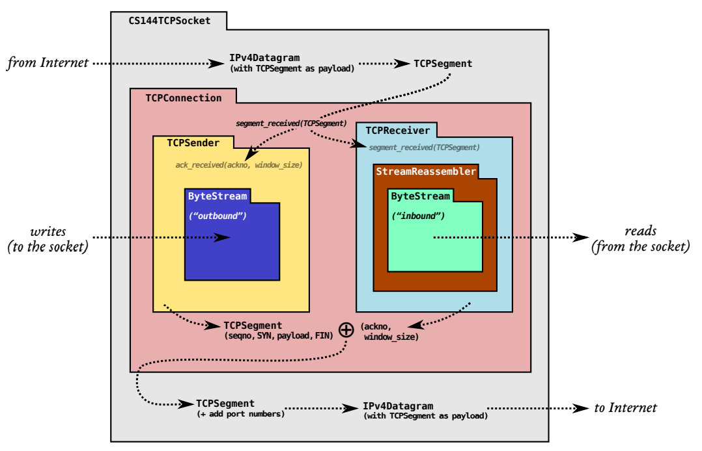
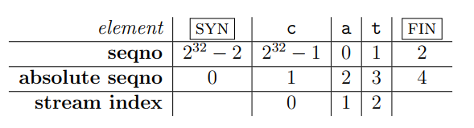

# Tcp receiver

## The big picture

TCP is a protocol that reliably conveys a pair of flow-controlled byte streams (one in each direction) over unreliable datagrams. 

Two parties participate in the TCP connection, and each party acts as both “sender” (of its own outgoing byte-stream) and “receiver” (of an incoming byte-stream) at the same time. The two parties are called the “endpoints” of the connection, or the “peers.”



## What does Tcp receiver do ?

- **responsible for receiving TCP segments (the actual datagram payloads)**

- **reassembling the byte stream (including its ending, when that occurs)**

- **determining that signals that should be sent back to the sender for acknowledgment and flow control.** These signals are crucial to TCP’s ability to provide the service of a flow-controlled, reliable byte stream over an unreliable datagram network.

  - Acknowledgment means, “What’s the index of the next byte that the receiver needs so it can reassemble more of the ByteStream?” 

    This tells the sender what bytes it needs to send or resend. (ackno)

  - Flow control means, “What range of indices is the receiver interested and willing to receive?” (usually as a function of its remaining capacity). 

    This tells the sender how much it’s allowed to send.(window size)

## Function requirement

- receive segments from its peer
- reassemble the ByteStream using your StreamReassembler
- calculate the acknowledgment number (ackno) and the window size. The ackno and window size will eventually be transmitted back to the peer in an outgoing segment.

## Interface

```c++
// Construct a `TCPReceiver` that will store up to `capacity` bytes
TCPReceiver(const size_t capacity); // implemented for you in .hh file
// Handle an inbound TCP segment
void segment_received(const TCPSegment &seg);
// The ackno that should be sent to the peer
//
// returns empty if no SYN has been received
//
// This is the beginning of the receiver's window, or in other words,
// the sequence number of the first byte in the stream
// that the receiver hasn't received.
std::optional<WrappingInt32> ackno() const;
// The window size that should be sent to the peer
//
// Formally: this is the size of the window of acceptable indices
// that the receiver is willing to accept. It's the distance between
// the ``first unassembled'' and the ``first unacceptable'' index.
//
// In other words: it's the capacity minus the number of bytes that the
// TCPReceiver is holding in the byte stream.
size_t window_size() const;
// number of bytes stored but not yet reassembled
size_t unassembled_bytes() const; // implemented for you in .hh file
// Access the reassembled byte stream
ByteStream &stream_out(); // implemented for you in .hh file
```

## Solution

### segment_received

Step by step:

- Check valid
  - if not ever sync, ignore
  - has syn already but receive syn again, ignore

- Check and set SYN/FIN

  - set _syn_received and _isn
  - set _fin_received

  we will use those flag when compute ackno.

- Reassembler

  - push substring to reassembler
  - if receiving syn(at start connecting point), abs_seqno will be 0
  - if received syn, abs_seqno needs to decrease 1 to match stream index.(excluding syn)

  

### ackno

- return null when not received SYN yet.

- abs_seqno = bytes_written + 1(SYN)
- if received FIN **and** has no unassembled stream, increase 1(FIN)

