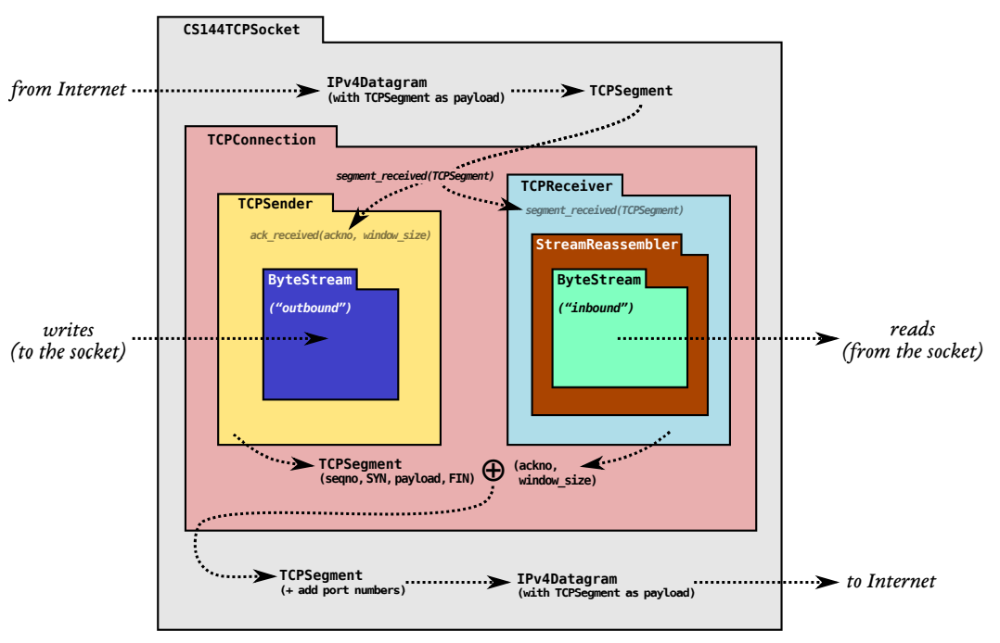
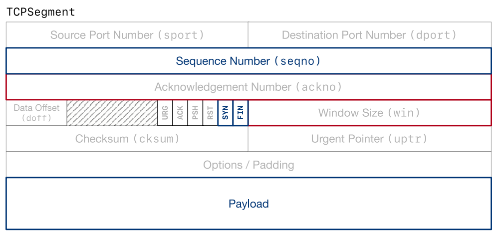

# Tcp sender

## The big picture

The TCP sender is a tool that translates from an outgoing byte stream to segments that will become the payloads of unreliable datagrams.

Also the very same but very important picture:



## What does Tcp sender do ?

- Responsible for reading from a ByteStream (created and written to by some sender-side application), 

- Turning the stream into a sequence of outgoing TCP segments. 

  On the remote side, a TCP receiver transforms those segments (those that arrive—they might not all make it) back into the original byte stream, and sends acknowledgments and window advertisements back to the sender.

From data flowing aspect, TCP sender and receiver read/write different parts of segments:

| Module       | Read                                     | Write                        |
| :----------- | :--------------------------------------- | :--------------------------- |
| TCP receiver | segments(from remote sender)             | ackno, window size           |
| TCP sender   | ackno, window size(from remote receiver) | seqno, SYN&FIN flag, payload |

These are the fields that are written by the sender, and read and acted on by the receiver.



## Function requirement

- Keep track of the receiver’s window (processing incoming acknos and window sizes) .
- Fill the window when possible, by reading from the ByteStream, creating new TCP segments (including SYN and FIN flags if needed), and sending them. **The sender should keep sending segments until either the window is full or the ByteStream is empty.**
- **Keep track of which segments have been sent but not yet acknowledged by the receiver**— we call these “outstanding” segments.
- **Re-send outstanding segments** if enough time passes since they were sent, and they haven’t been acknowledged yet.

The basic principle is to send whatever the receiver will allow us to send (filling the window), and keep retransmitting until the receiver acknowledges each segment. This is called “automatic repeat request” (ARQ). 

The sender divides the byte stream up into segments and sends them, as much as the receiver’s window allows. The remote TCP receiver can reconstruct the byte stream as long as it receives each index-tagged byte at least once—no matter the order. The sender’s job is to make sure the receiver gets each byte at least once.

## Lost and resend

The TCPSender is responsible for looking through its collection of outstanding TCPSegments and deciding if the oldest-sent segment has been outstanding for too long without acknowledgment (that is, without all of its sequence numbers being acknowledged). If so, it needs to be retransmitted (sent again).

The overall goal is to let the sender detect when segments go missing and need to be resent, in a timely manner. The amount of time to wait before resending is important: 

- You don’t want the sender to wait too long to resend a segment (because that delays the bytes flowing to the receiving application)
- But you also don’t want it to resend a segment that was going to be acknowledged if the sender had just waited a little longer—that wastes the Internet’s precious capacity.

### RFC 6298

An implementation MUST manage the retransmission timer(s) in such a way that a segment is never retransmitted too early, i.e., less than one RTO after the previous transmission of that segment.

The following is the RECOMMENDED algorithm for **managing the retransmission timer:**

1. **Every time a packet containing data is sent** (including retransmission), if the timer is not running, **start it running** so that it will expire after RTO seconds (for the current value of RTO since RTO may change according to congest control algrithm).
2. When **all outstanding data has been acknowledged, turn off the retransmission timer**.
3. When **an ACK is received** that acknowledges new data, **restart the retransmission timer** so that it will expire after RTO seconds (for the current value of RTO)

When the retransmission timer expires, do the following:

1. Retransmit the earliest segment that has not been acknowledged by the TCP receiver.
2. The host MUST set RTO = RTO*2 (back off the timer). The maximum value may be used to provide an upper bound to this doubling operation.
3. Start the retransmission timer, such that it expires after RTO seconds (after doubling operation).
4. If the timer expires **awaiting the ACK of a SYN segment** and the TCP implementation is using an RTO less than 3 seconds, the RTO MUST be **re-initialized** to 3 seconds when data transmission begins. (aka after three-way handshake completes).

## Interface

```c++
void fill_window()
/*
The TCPSender is asked to fill the window: it reads from its input ByteStream and
sends as many bytes as possible in the form of TCPSegments, as long as there are new
bytes to be read and space available in the window.
You’ll want to make sure that every TCPSegment you send fits fully inside the receiver’s
window. Make each individual TCPSegment as big as possible, but no bigger than the
value given by TCPConfig::MAX PAYLOAD SIZE (1452 bytes).
You can use the TCPSegment::length in sequence space() method to count the total
number of sequence numbers occupied by a segment. Remember that the SYN and
FIN flags also occupy a sequence number each, which means that they occupy space in
the window.

If the receiver has announced a
window size of zero, the fill window method should act like the window size is
one. The sender might end up sending a single byte that gets rejected (and not
acknowledged) by the receiver, but this can also provoke the receiver into sending
a new acknowledgment segment where it reveals that more space has opened up
in its window. Without this, the sender would never learn that it was allowed to
start sending again.
*/

void ack_received( const WrappingInt32 ackno, const uint16 t window size)
/*
A segment is received from the receiver, conveying the new left (= ackno) and right (=
ackno + window size) edges of the window. The TCPSender should look through its
collection of outstanding segments and remove any that have now been fully acknowledged (the ackno is greater than all of the sequence numbers in the segment). The
TCPSender should fill the window again if new space has opened up.
*/
    
void tick( const size t ms since last tick )
/*
Time has passed — a certain number of milliseconds since the last time this method
was called. The sender may need to retransmit an outstanding segment.
*/
    
void send empty segment()
/*
The TCPSender should generate and send a TCPSegment
that has zero length in sequence space, and with the sequence number set correctly.
This is useful if the owner (the TCPConnection that you’re going to implement next
week) wants to send an empty ACK segment.

Note: a segment like this one, which occupies no sequence numbers, doesn’t need to be
kept track of as “outstanding” and won’t ever be retransmitted.
*/
```

## Solution

### Ack_received

**Step 1: Check ackno valid and update window size**

if not valid or valid but dummy, do the following and return:

- If ackno greater than next_seqno, since ackno = received_seqno + 1 (aka next_seqno), invalid, return directly.

- Dummy ackno but valid (ackno <= received_ackno)

  Update window size even ackno has recevied before (the window size may change), then return.

  Update remainingwindow size according to window size and retransmission size.

  Check the window size is full or not (retransmission segments may fill up window)

if valid and not dummy, go to next step.

**Step 2: Update received ackno.**

**Step 3: Remove acked segment from segment_outstanding**(waiting list for acknowledge).

- update bytes_in_flight
- update retransmission timer and consecutive retransmission cnt

**Step 4: Update window size and remaining window size.**(the same as step 1)

**Step 5: Turn off timer if all segments acknowledged.**

**Step 6: fill window.**

### Fill window

**Step 1: Check SYN**

- If SYN not send yet, send SYN.
- If SYN send but has not been acknowledged, do nothing.

**Step 2: Check FIN**

If out stream is end and FIN has not been sent, there are two possible status:

- The window is full, so there are no space for FIN flag, just return and waiting for another shoot.
- In active close status, so send FIN flag and return

**Step 3: Fill remaining window size**

When ackno was received, some outstanding segments were retransmitted and occupied space of window, so only remaining window size was left for new payload. 

Keep filling remaining window with segments until no space left.

- Create a new segment, set segment seqno and payload (loading bytes from stream).

- Check stream eof and set FIN flag if needs to.

  Notice that FIN flag occupies a bit in window,  so only set FIN flag when both eof is true and window still has remaining space.

-  Update remaining window size according to payload size and FIN flag (if exist). 

- Send segment and add to outstanding queue (in case needs to retransmit) if not empty. 

  Return if segment is empty. Update next_seqno and bytes_in_flight while sending segment.

### Tick

Basically do as RFC 6298 suggests, be aware of following contents:

- Double RTO if window_size is not zero **OR** retransmit SYN segment(aka SYN was not received yet)
- Re-initialize RTO if no segment needs to be retransmit.
