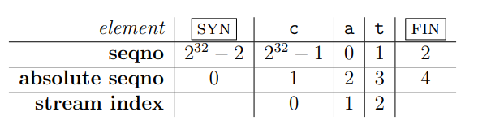
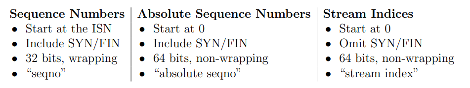

# Wrapping integers

## Why do this?

In the TCP headers, space is precious, and each byte’s index in the stream is represented not with a 64-bit index but with a 32-bit “sequence number,” or “seqno.” This adds three complexities:

-  **Warp around 32-bit integers.** 

  Streams in TCP can be arbitrarily long—there’s no limit to the length of a ByteStream that can be sent over TCP. But 2^32 bytes is only 4 GiB, which is not so big. Once a 32-bit sequence number counts up to 2^32 − 1, the next byte in the stream will have the sequence number zero.

- **TCP sequence numbers start at a random value.**

  To improve security and avoid getting confused by old segments belonging to earlier connections between the same endpoints, **TCP tries to make sure sequence numbers can’t be guessed and are unlikely to repeat**. **So the sequence numbers for a stream don’t start at zero.** 

  **The first sequence number in the stream is a random 32-bit number called the Initial Sequence Number (ISN)**. This is the sequence number that represents the SYN (beginning of stream). The rest of the sequence numbers behave normally after that: the first byte of data will have the sequence number of the ISN+1 (mod 2^32), the second byte will have the ISN+2 (mod 2^32), etc.

- **The logical beginning(SYN) and ending(FIN) each occupy one sequence number.**

  In addition to ensuring the receipt of all bytes of data, TCP makes sure that the beginning and ending of the stream are received reliably. Thus, in TCP the SYN (beginning-of-stream) and FIN (end-of-stream) control flags are assigned sequence numbers. Each of these occupies one sequence number. (The sequence number occupied by the SYN flag is the ISN.) 

  Each byte of data in the stream also occupies one sequence number. 

  Keep in mind that SYN and FIN aren’t part of the stream itself and aren’t “bytes”—they represent the beginning and ending of the byte stream itself.

## Function requirement

Convert among **sequence numbers**, **absolute sequence numbers** and **stream index**.

The three different types of indexing involved in TCP:



Converting between absolute sequence numbers and stream indices is easy enough—just add or subtract one. 

Converting between sequence numbers and absolute sequence numbers is a bit harder, and confusing the two can produce tricky bugs. To prevent these bugs systematically, we’ll represent sequence numbers with a custom type: WrappingInt32, and write the conversions between it and absolute sequence numbers (represented with uint64_t). 

WrappingInt32 is an example of a wrapper type: a type that contains an inner type (in this case uint32_t) but provides a different set of functions/operators.



## Interface

```c++
WrappingInt32 wrap(uint64 t n, WrappingInt32 isn)
/*
Convert absolute seqno → seqno. Given an absolute sequence number (n) and an
Initial Sequence Number (isn), produce the (relative) sequence number for n.
*/
uint64 t unwrap(WrappingInt32 n, WrappingInt32 isn, uint64 t checkpoint)
/*
Convert seqno → absolute seqno. Given a sequence number (n), the Initial
Sequence Number (isn), and an absolute checkpoint sequence number, compute the
absolute sequence number that corresponds to n that is closest to the checkpoint.

Note: A checkpoint is required because any given seqno corresponds to many absolute
seqnos. 
E.g. with an ISN of zero, the seqno “17” corresponds to the absolute seqno of
17, but also 2^32 + 17, or 2^33 + 17, or 2^34 + 17, etc.
The checkpoint helps resolve the ambiguity: 
it’s an absolute seqno that the user of this class knows is “in the ballpark” of the correct answer.
Here, “in the ballpark” can mean any 64-bit number that’s within ±2^31 of the right answer.
In your TCP implementation, you’ll use the index of the last reassembled byte as the checkpoint.
*/
```

## Solution

### Wrap

seqno = absolute_seqno + isn

### Unwrap

- get offset between two uint32_t type integers (seqno and isn).

  ```c++
  uint32_t a = 1;
  uint32_t b = 0;
  
  uint32_t offset = a - b;
  // offset = 1
  
  uint32_t offset = b - a;
  // offset = 2^32 - 1
  // a b ---->
  // wrap round, just like start from b reach a in another direction 
  // uint32_t range: [0, 2^32-1]
  ```

  **absolute_seqno = x * 2^32 + offset**

  find the correct "x" according to checkpoint.

- split uint64_t checkpoint as two part: **checkpoint = a * 2^32 + b**

  the absolute_seqno closest to checkpoint must be one of those:

  - **(a-1) * 2^32 + offset** 
  - **a * 2^32 + offset**
  - **(a+1) * 2^32 + offset**

- choose the closest one among those three integers by compare each other.

  notice if a = 0, the a-1 case is illegal, choose between the other two cases.